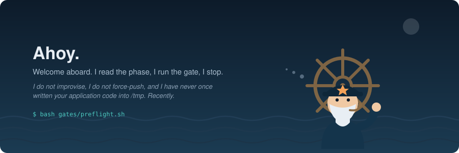
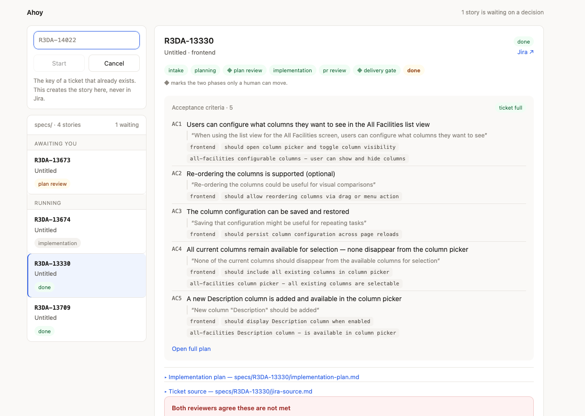
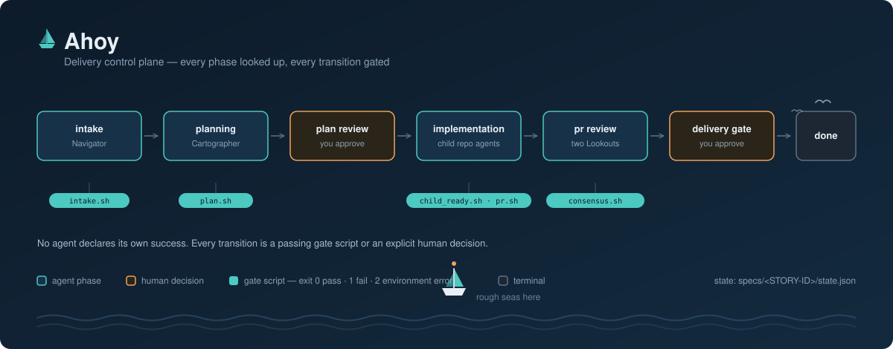

# R3DA niooo Ahoy Workspace

Shared agentic AI workspace for the software development team. This repository is the control plane from which complete user-story and bug-fix deliveries are coordinated across the team's application repositories.



### Check the [Setup Guide](docs/setup.md) for the hard requirements and installation instructions.

## Running a delivery

One command.

```sh
bin/serve.sh
```

Open <http://127.0.0.1:8765>. Node standard library only — no build step, no
`npm install`, nothing to compile. `--port` and `--host` exist; there is no
auth, so leave the host on localhost.

The left column lists every story under `specs/` with the phase it is in, and
counts how many are waiting on you. Pick one and you get its plan, its reviews,
its reports, and whichever action it is actually waiting on.



### Starting a story

**+ New story**, top of the list. Type the Jira key, press Start.

The ticket must already exist in Jira — this creates the story *here*, never
there. That runs `bin/run.sh <KEY>` and streams the router into a terminal panel
in the page. It fetches the ticket and plans it with you: intake and planning
are interactive by design, so Cartographer will ask you things and you answer in
that panel. Then it implements, waits for CI, opens the pull request, runs both
reviewers, and stops at the delivery gate.

A story that already exists is picked up from wherever it actually is rather
than restarted, so the same button is the way back into one you left. Nothing is
held in memory between runs — a closed laptop costs a click, not the story.

The key is not validated in the browser. `bin/start.sh` owns the rule about what
a Jira key looks like and refuses a bad one with a sentence written for a
person; a second opinion in the page would eventually disagree with it.

### The two gates

At `plan_review` and `delivery_gate` the story stops and the decision panel
appears — a box to type in and three outcomes:

- **Approve plan** *(or Approve delivery)* — record the decision and carry on.
- **Send back** — what you typed goes to the agent that produced the work,
  resuming its own session so it remembers the earlier rounds instead of
  re-deriving everything from the plan it just wrote.
- **Reject** — record the rejection, with the box as the reason.

**Two decisions, and both are ones only a person can make**: whether the plan
covers the ticket, and whether this ships. Everything between them runs
unattended.

There is no default and no timeout, in either interface. Nothing approves itself
after waiting. Silence is never approval.

### When there is no decision to make

The panel matches the story rather than always offering the same buttons:

- Mid-phase with nothing running — **Continue** picks the story up where it
  actually is and carries on. A stopped story is a click, not a lost one.
- Already delivered, or a gate already decided — **Rework** reopens it. It says
  first that this clears the acceptance it is undoing, because that is the part
  a button cannot take back for you.
- While an agent is running — the terminal panel is live. Type into it and the
  agent gets it; that is where Cartographer's questions arrive, and where you
  answer them.

### Reading the story

Plans and reviews render as markdown rather than as a wall of text, with a
**Source** toggle for the raw file. Acceptance criteria, reviewer verdicts, work
packages, gate results and the decision log each get their own section.

The page polls while you have it open, so a plan Cartographer finishes appears
without a refresh — open sections, scroll position and the cursor in a
half-typed rework box all survive the update.

**Credits** shows what the story has cost in AIU, grouped by phase, read from
the Copilot CLI's own usage ledger and recorded into `state.json` by
`bin/credits.sh` as each agent runs. A story whose spend predates that
bookkeeping shows no panel at all rather than a fabricated zero.

### From the terminal

The same delivery, without the browser:

```sh
bin/run.sh R3DA-14022
```

It stops at the same places, with the menu the panel is a picture of:

```
plan_review — R3DA-14022
  plan: specs/R3DA-14022/implementation-plan.md
  3 acceptance criteria, 2 work package(s) across: frontend

    AC1: The panel divider can be dragged vertically.
    AC2: Panels cannot be resized below a minimum height.
    AC3: The chosen height survives a page reload.

  Nothing upstream checks whether these COVER the ticket. That is this gate.

  1) approve  — record the decision and carry on
  2) revise   — say what to change; back to the agent that made it
  3) chat     — open a session to talk it through, change nothing
  4) quit     — decide later; nothing is recorded

>
```

Press `1` twice, a phase apart, and the story is done. Re-run `bin/run.sh` at
any point and it continues from wherever the story is.

### Without a person

The menu appears only when someone is there — piped or scheduled, the harness
prints the command and stops rather than blocking forever. The same decisions
are available as commands, which is what both the menu and the buttons call:

```sh
bin/approve.sh R3DA-14022 plan
bin/approve.sh R3DA-14022 plan --reject "AC coverage is incomplete"
bin/revise.sh  R3DA-14022 plan -- "the frontend criteria miss the empty state"
```

### What the UI is not

It is a second interface to the harness, not a second implementation of it.
`bin/serve.js` reads `state.json` and `phases.tsv`; **it writes neither.** Every
button shells out to the command above that already owned that decision, and
each runs with `--no-continue` so a refusal comes back legible instead of
disappearing into a request that blocks for the length of an agent run.

That is not tidiness. The rules about what may be approved live in one place, in
the harness, and are as true in the browser as in the terminal because the
browser does not know them. The one bug this design caught the hard way was a UI
that had reimplemented "has this gate been decided?" and got it subtly wrong,
greying out the buttons for every story it was meant to serve.

## The principle

> A gate is only a gate if at least one of its inputs comes from somewhere the
> agent does not control.

`gates/` turns each phase's completion criteria into an exit code. **The harness
runs them and routes on the result. No agent decides whether its own work
passed, and no agent writes `phase`.**

That last part is the whole design. An agent that reports on its own gate is
grading its own homework, and the report is indistinguishable from the truth
until something independent checks. Here the only thing that moves a story
forward is a gate exiting zero.

**The gates are bash; the harness that runs them is Node.** That split is
deliberate: a gate is `gh` and `jq` with an exit code on the end, which is what
shell is good at, and the router is a state machine over a JSON file, which is
not. The exit-code contract below does not care what language calls it. See
[docs/decisions.md](docs/decisions.md).

The exit-code contract, in full:

| code | meaning | router does |
|---|---|---|
| 0 | pass | advance to `on_pass` |
| 1 | not yet | stay, or route to `on_fail`; with `--wait`, poll |
| 2 | environment broken | stop, touch nothing |
| 3 | branch | route to rework |
| 4 | halt | stop; a human decides |

## Repository layout

```text
bin/                     The harness, in Node. tick.js (the router), run.js,
                         start.js, approve.js, revise.js, decide.js,
                         dispatch.js, review.js, repo.js, credits.js,
                         serve.js (the UI server). Each has a two-line .sh
                         shim of the same name, so every caller still works
  lib/                   Shared harness code: state.json I/O, the phase table,
                         agent profiles, the repo mapping, derived values
web/                     The browser UI. Plain ES modules, no build step
gates/                   Phase criteria as exit codes, in bash (process tooling,
                         not product code)
agents/                  Agent profiles for this control plane
knowledge/
  process/
    delivery-phases.md   The phase table, for humans
    phases.tsv           The same table, for bin/tick.js
    child-dispatch-contract.md   What crosses the boundary to a child repository
    state-schema.md      The shape of state.json
  repositories/          Repository inventory and agent mappings
specs/<STORY-ID>/        Per-story artifacts: jira-source.md, implementation-plan.md,
                         state.json, reviews/, reports/
tests/                   Offline assertions for every gate and harness script
docs/decisions.md        Decisions and the failures that forced them
work/                    Child-repository clones and per-story worktrees (gitignored)
```

The harness and the UI server use the **Node standard library only** — no
dependencies, no build step, no `package.json`. `gates/` needs `bash` and `jq`,
as it always has, and the UI's interactive panel needs `script(1)` for a
pseudo-terminal. There is no Python.

Application code belongs in its owning repository. Child repositories remain
authoritative for their own instructions, build configuration, tests, and
conventions — including the `tools:` list in their agent profiles, which the
harness reads rather than overrides.

## How a story moves

`knowledge/process/phases.tsv` is the state machine. `bin/tick.js` reads a
story's phase, runs that row's actor, runs that row's gate, and writes the next
phase from the exit code. It loops until a human gate or a terminal phase.
Nothing in `bin/` hardcodes a phase; the table is read, never reproduced.

| phase | actor | gate | on pass |
|---|---|---|---|
| `intake` | navigator | `intake.sh` | `planning` |
| `planning` | cartographer *(interactive)* | `plan.sh` | `plan_review` |
| `plan_review` | — | *human* | `implementation` |
| `implementation` | `bin/dispatch.sh` | `child_ready.sh`, then `pr.sh` | `pr_review` |
| `pr_review` | `bin/review.sh` | `consensus.sh` | `delivery_gate` |
| `delivery_gate` | — | *human* | `done` |

`planning` is interactive: the harness hands Cartographer your terminal so it
can ask you things. Every other phase runs unattended.

`tests/check-phase-table.sh` fails if the prose table and the TSV disagree.

## Delivery state

Every in-flight delivery has a durable state file at `specs/<STORY-ID>/state.json`.
Every script reads it at the start and writes it at the end. **The control flow
lives in that file, not in an agent's conversation history** — which is why a
story survives a crashed session, a closed laptop, or a week's gap.

Human decisions are recorded as `{status, timestamp}` and written **only** by
`bin/approve.sh`. The timestamp is the half a boolean cannot carry: a plan
approved three rounds of change ago is not self-evidently still approved.

The file's shape did not change when the harness moved to Node, so a story that
was mid-flight across the port needed no migration.

## What the two Lookouts are for

`pr_review` runs two reviewers as separate processes on different models with
different lenses — `lookout-design` on design and fit, `lookout-defect` on
failure and edge cases. `gates/consensus.sh` rejects the pair if they share a
model or a lens, because two runs of one model on one lens is a single review
recorded twice.

Every acceptance criterion gets an explicit verdict from both. Where they
**agree** something is unmet, that is work and routes to rework. Where they
**disagree**, that goes to a human: sending it to rework would tell a fixer to
fix something a competent reviewer says is already correct, and that loop has no
exit condition.

## Tests

```sh
tests/run.sh                 # every gate's exit-code contract, plus the harness
tests/check-phase-table.sh   # the prose table and the TSV still agree
```

Offline. No network, no credentials, no model. `gh` is stubbed. The cases live
in `tests/cases/*.test.js` and run under `node:test`; run one directly while
iterating with `node --test tests/cases/tick.test.js`.

The gate tests run the **real** `gates/*.sh` against the `gh` stub in
`tests/bin/gh`. That is the property the suite is worth anything for: the
exit-code contract is checked against the scripts that ship, not against a
JavaScript imitation of them. Where the harness's own logic is under test, the
tests import it from `bin/lib/` for the same reason.

This suite is not optional decoration. Until it existed, the exit-code contract
was a claim about the scripts rather than a property of them — and it was wrong.
`consensus.sh` called a function that did not exist, so every branch and halt
route in it was unreachable. `rework_ceiling.sh` returned "poll again" on
reaching the ceiling, which is precisely the loop a ceiling exists to stop.
`child_ready.sh` misread GitHub's check API and would have blocked a green pull
request indefinitely.

None of those were visible while an agent was reporting on the gates. They
surfaced the moment something else ran the scripts and a test asserted what came
back.

The same lesson landed again during the port: `gates/plan.sh` was missing the
one-branch-per-repository check, while the suite tested that rule against a copy
of the rule pasted into the test file. Both are recorded in
[docs/decisions.md](docs/decisions.md).

## Delivery principle



Start each user-story or bug-fix delivery from this workspace. Establish scope
and acceptance criteria, identify the affected repositories and specialists,
create isolated child-repository worktrees, implement and verify there, and stop
at the required human approval gates.